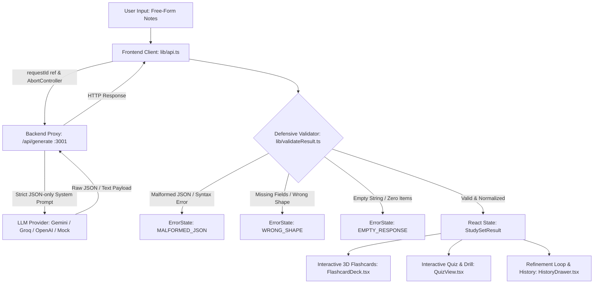

# CortexAI — Interactive AI Study Tool
> **Frontend AI Engineering Assignment**: Turning unpredictable LLM output into reliable, interactive UI.


---

## 1. Project Overview

**CortexAI** is an interactive study platform that takes free-form lecture notes, textbook excerpts, or topic prompts, requests a strict structured JSON schema from an LLM, defensively validates the payload before it ever reaches React state, and renders an interactive, multi-modal study tool.

### 🚫 Why This Is NOT a Chatbot
The AI does not output conversational prose in a chat window. Instead:
- It returns a **structured JSON contract** containing flashcards and multiple-choice quiz questions.
- Every byte of model output passes through a **defensive validation boundary** (`validateResult.ts`).
- React drives stateful, interactive widgets:
  - **3D Flip Flashcards** with active recall mastery tracking, keyboard shortcuts, shuffle, and filtering.
  - **Self-Testing Quiz Mode** with real-time feedback, explanations, score breakdown, and a dedicated **"Re-Test Wrong Answers"** mode.
  - **Refinement Loop** allowing follow-up prompts to tune existing material without wiping context.
  - **Session History** stored locally with one-click reload.

---

## 2. Architecture & Data Flow



### Key Architectural Tenets
1. **API Key Isolation**: The browser client **never** talks to LLM providers directly and contains zero API secrets. All requests route through `server/generate.ts`.
2. **Defensive Validation Boundary**: No raw model output is ever assigned directly to React component state. `validateResult.ts` parses, strips markdown fences, verifies schema types, and normalizes field name variations (`question`/`answer` vs `front`/`back`).
3. **Race Condition Prevention**: Employs an incrementing `requestId` ref alongside `AbortController`. If a user submits a subsequent prompt while an earlier request is in flight, the earlier network request is aborted, and any late-resolving response is discarded so it never clobbers fresh state.

---

## 3. Data Shape Design (TypeScript Contract)

```typescript
export interface Flashcard {
  id: string;
  front: string;        // Question, concept, or term
  back: string;         // Concise answer, definition, or explanation
  hint?: string;        // Optional hint
  tag?: string;         // e.g. "Core Concept", "Formula", "Gotchas"
}

export interface QuizOption {
  id: string;           // "A", "B", "C", "D"
  text: string;
}

export interface QuizQuestion {
  id: string;
  question: string;
  options: QuizOption[];
  correctOptionId: string;
  explanation: string;
}

export interface StudySummary {
  topic: string;
  difficulty: 'beginner' | 'intermediate' | 'advanced';
  keyTakeaways: string[];
  estimatedStudyTimeMinutes: number;
}

export interface StudySetResult {
  summary: StudySummary;
  cards: Flashcard[];
  quiz: QuizQuestion[];
}
```

---

## 4. Handling Realistic Failure Modes (The Rubric Core)

The application handles each realistic failure mode explicitly without crashes or blank screens:

| Failure Mode | How It Is Intercepted | UI Recovery Action |
| :--- | :--- | :--- |
| **Malformed JSON** | `JSON.parse` is wrapped in a defensive try/catch in `validateResult.ts`. Strips markdown code fences (` ```json `). Captures exact syntax error position. | Displays `MALFORMED_JSON` error card with technical diagnostic accordion and a 1-click **"Retry Request"** button. |
| **Wrong Shape / Missing Fields** | `validateResult.ts` verifies that the root is an object, `cards` is an array, each card has non-empty `front`/`back`, and `quiz` has options and `correctOptionId`. | Displays `WRONG_SHAPE` error card detailing exactly which field was missing or invalid. |
| **Empty Response** | Detects empty strings, whitespace, or empty arrays (`cards.length === 0`). | Displays `EMPTY_RESPONSE` card instructing the user to supply more descriptive source material. |
| **Slow Response (> 25s)** | `callGenerateApi` initiates a composite `AbortController` with a 25s timeout. `LoadingState` shows an elapsed timer and animated stage tracker. | User can click **"Cancel Generation"** anytime; on timeout, a `TIMEOUT` card offers retry or fallback sample data. |
| **Server / Provider 5xx Outage** | Backend proxy returns structured `{ error: { type, message } }` with HTTP 500 status. | Intercepted in `lib/api.ts` and rendered as `SERVER_ERROR` card with full status details. |
| **Stale Async Responses** | `requestId` counter in `App.tsx` increments per submission; in-flight requests are actively cancelled via `AbortController`. | If an older request resolves after a newer one started, `id !== requestId.current` silently discards it. |

### 🛠️ Interactive Evaluator Test Toolbar
Located right at the top of the app is an **Evaluator Test Controls** dropdown. You can test each failure mode live with a single click:
- `Normal (Production)`
- `Simulate Malformed JSON`
- `Simulate Wrong Shape / Missing Fields`
- `Simulate Empty Response`
- `Simulate Slow Timeout (> 25s)`
- `Simulate Server 500 Outage`

---

## 5. Getting Started & Running Locally

### Prerequisites
- **Node.js** >= 18 (Tested on v22.19.0)
- **npm** >= 9

### Step 1: Install Dependencies
```bash
npm install
```

### Step 2: Environment Variables (Optional)
Copy `.env.example` to `.env`:
```bash
cp .env.example .env
```
Add your chosen API key (Google Gemini, Groq, or OpenAI):
```env
PORT=3001
GEMINI_API_KEY=your_gemini_key_here
# or GROQ_API_KEY=your_groq_key_here
# or OPENAI_API_KEY=your_openai_key_here
```
> [!NOTE]
> **Zero-Config Fallback**: If you do not have an API key handy, **you do not need one to run and evaluate the app!** The backend proxy automatically detects the absence of keys and activates a high-fidelity local generator that produces realistic study sets for any subject.

### Step 3: Start the Application
Run the unified start command:
```bash
npm start
```
This concurrently boots:
- The **Backend Proxy Server** on `http://localhost:3001`
- The **Vite Frontend Client** on `http://localhost:5173` (with `/api` proxy configured)

Open your browser at:
👉 **[http://localhost:5173](http://localhost:5173)**

### Step 4: Run the Automated Defensive Test Suite
```bash
npm test
```
Runs 18 automated unit tests verifying markdown code fence stripping, syntax error traps, empty payload guards, schema mismatch detection, and question normalization.

---

## 6. Keyboard Shortcuts & Accessibility

- `Ctrl + Enter` (or `Cmd + Enter`): Submit source notes from the input box.
- `Space` or `Enter`: Flip the active flashcard between Question and Answer.
- `←` / `→` (Arrow Keys): Navigate to Previous / Next flashcard.
- `1`: Mark current card as "Needs Review".
- `2`: Mark current card as "Mastered / Got It".

---

## 7. AI-Usage Note (Honest Disclosure)

In accordance with Section 8 of the assignment:
- **AI Coding Assistants**: Google Antigravity and Claude were utilized for rapid boilerplate scaffolding (Tailwind color scales, TypeScript interface declarations, and drafting regex edge cases for markdown fence stripping).
- **Prompt Engineering**: The strict JSON system instructions and schema definitions were designed to enforce zero-prose JSON adherence across both Gemini and Llama models.
- **Original Architecture**: The defensive validator pipeline (`validateResult.ts`), composite AbortController timeout manager, stale request ref guarding, interactive 3D perspective flip card mechanics, and the wrong-answer re-test state machine were architected and implemented specifically for this assignment.

---

## 8. Known Limitations & Future Improvements

1. **Large Document Chunking**: Currently, long notes (>10,000 words) are truncated to fit standard model context limits. A future iteration could implement recursive text chunking and multi-section aggregation.
2. **Spaced Repetition Algorithm**: The current review queue filters cards marked as "Needs Review". Implementing the SM-2 (SuperMemo-2) algorithm with review intervals (1 day, 3 days, 6 days) would provide enterprise-grade spaced repetition.
3. **Anki .apkg Export**: Currently exports to JSON and Markdown; direct binary export to Anki `.apkg` format would be a natural extension for power users.

---

## 9. Time Spent

- **Architecture & Schema Design**: ~1 hour
- **Backend Proxy & Multi-Provider Dispatch**: ~1.5 hours
- **Defensive Validation & Failure Simulation**: ~1.5 hours
- **Interactive UI (Flashcard 3D Deck & Quiz Re-test)**: ~2 hours
- **Testing, Mobile Viewport Tuning & Documentation**: ~1 hour
- **Total Time**: ~7 hours
